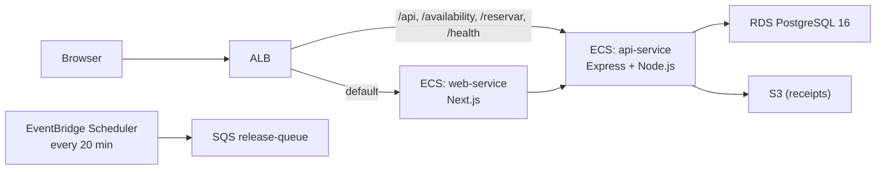

# Observability Plan — Parking Reservation System

**Date:** 2026-06-13  
**Cloud Provider:** AWS (us-east-1)

---

## 1. Repository Discovery

### Architecture

The system is an internal parking reservation tool for a single company. It has two AWS ECS Fargate services (API and web frontend) behind a public ALB, a single PostgreSQL 16 RDS instance, and three SQS queues for async messaging.



### Main API Endpoints

| Route | Method | Auth |
|---|---|---|
| `/health` | GET | none |
| `/ready` | GET | none |
| `/auth/login` | POST | none |
| `/availability` | GET | JWT |
| `/reservar` | POST | JWT (driver) |
| `/reservations/:id/confirm` | POST | JWT (driver) |
| `/reservations/:id/release` | POST | JWT (driver) |
| `/reservations/:id/cancel` | POST | JWT (driver) |
| `/admin/dashboard/occupancy` | GET | JWT (admin) |

### Key Services

| Component | Tech | Notes |
|---|---|---|
| API | Express 4, TypeScript, Pino logging | Port 8080, JWT auth, rate limit 120 req/min |
| Database | PostgreSQL 16 on RDS `db.t3.micro` | Single pool per container via `node-postgres` |
| Background job | `node-cron` every 1 min | Auto-expires reservations past `confirm_deadline` |
| Object storage | AWS S3 | Receipt PDFs, fire-and-forget upload |
| Queues | 3 SQS queues + DLQs | receipt, release, email — consumers not yet deployed |
| Secrets | SSM Parameter Store | `DATABASE_URL`, `JWT_SECRET`, `ENCRYPTION_KEY`, `HMAC_KEY` |

### Existing Observability

| What exists | Where |
|---|---|
| Structured JSON logging (Pino) | `backend/src/lib/logger.ts` |
| HTTP request logging (pino-http) | `backend/src/app.ts:24` |
| Liveness probe `/health` | `health.routes.ts` |
| Readiness probe `/ready` (SELECT 1 to DB) | `health.routes.ts` |
| DLQs on all 3 SQS queues | `infra/modules/async/` |
| **No metrics, no tracing, no alerts, no dashboards** | — |

---

## 2. Observability Assessment

### Structured Logging

**What is in place:** Pino emits structured JSON per request via `pino-http`. Log level is `info` in production, `debug` otherwise. Errors are logged with `logger.error({ err })` in `errorHandler.ts`.

**What is missing:**

| Gap | Priority |
|---|---|
| No correlation/request ID per HTTP request | High |
| No `userId` attached to log lines | Medium |
| Log destination (CloudWatch log group) not confirmed in Terraform compute module | High |

**Recommended log format:**

```json
{
  "level": "info",
  "time": "2026-06-13T08:05:00.000Z",
  "requestId": "req_a1b2c3d4e5f6",
  "userId": 42,
  "method": "POST",
  "url": "/reservar",
  "status": 201,
  "responseTime": 48,
  "msg": "request completed"
}
```

### Correlation IDs

**Current state:** None. A single failing request cannot be traced across multiple log lines.

**How to implement:**

1. **Generate** a `requestId` in `pino-http`'s `genReqId` option using `crypto.randomUUID()`.
2. **Attach to every log line** automatically via pino-http's child logger per request.
3. **Add `userId`** to the child logger inside the `requireAuth` middleware after JWT verification.
4. **Include in SQS messages** (when consumers are added): pass `requestId` as a message attribute.

Which log lines must include the `requestId`:
- Every HTTP access log (automatic via pino-http)
- Every `logger.error` in `errorHandler.ts`
- Every worker log line in `releaseExpired.ts` (use a `jobRunId` per cron tick instead)

**Example — current vs. target:**

```json
// Current (no context)
{"level":"error","time":1749820000000,"err":{"message":"ECONNREFUSED"},"msg":"Unhandled error"}

// Target (with correlation)
{"level":"error","time":"2026-06-13T08:05:01.000Z","requestId":"req_a1b2c3","userId":42,"url":"POST /reservar","err":{"message":"ECONNREFUSED"},"msg":"Unhandled error"}
```

### RED Metrics

#### API Service

**Rate**

| Metric | Unit | Source |
|---|---|---|
| Total requests/min | count | ALB `RequestCount` (CloudWatch auto) |
| Reservations created/min | count | CloudWatch Logs metric filter on `POST /reservar status=201` |

**Errors**

| Metric | Unit | Source |
|---|---|---|
| HTTP 5xx rate | count/min | ALB `HTTPCode_Target_5XX_Count` (CloudWatch auto) |
| HTTP 4xx rate | count/min | ALB `HTTPCode_Target_4XX_Count` (CloudWatch auto) |
| Unhandled errors | count/min | CloudWatch Logs metric filter on `"Unhandled error"` |
| Receipt generation failures | count/min | CloudWatch Logs metric filter on `"receipt generation failed"` |

**Duration**

| Metric | Unit | Source |
|---|---|---|
| API latency p50/p95/p99 | ms | ALB `TargetResponseTime` (CloudWatch auto) |
| `/availability` latency | ms | pino-http `responseTime` field — Logs Insights query |
| `/reservar` latency | ms | pino-http `responseTime` field — Logs Insights query |

#### Background Worker (`releaseExpiredWorker`)

| Metric | Unit | Source |
|---|---|---|
| Records expired per run | count | Logs Insights — `count` field in `"reservas expiradas"` line |
| Worker errors | count/run | CloudWatch Logs metric filter on `"[releaseExpired] error"` |

#### RDS and SQS (auto-collected)

| Metric | Unit | Source |
|---|---|---|
| RDS CPU utilization | % | CloudWatch RDS namespace |
| RDS database connections | count | CloudWatch RDS namespace |
| RDS free storage space | bytes | CloudWatch RDS namespace |
| SQS DLQ messages visible | count | CloudWatch SQS — per DLQ ARN |

---

## 3. Alerting Strategy

### Alert 1 — API 5xx Error Rate Spike

**Metric:** ALB `HTTPCode_Target_5XX_Count` (API target group)  
**Threshold:** > 5 errors in 5 minutes  
**Evaluation window:** 5 min, checked every 1 min  
**Severity:** High  
**Action:** Notify engineering team via SNS → email/Slack  
**Business impact:** Any 5xx during morning peak (7–9 AM) blocks users from reserving parking spaces. The system is time-sensitive — 15 minutes of errors at that time defeats the entire purpose of the platform.

---

### Alert 2 — Dead-Letter Queue Receives a Message

**Metric:** CloudWatch SQS `ApproximateNumberOfMessagesVisible` on each DLQ  
**Threshold:** > 0 messages  
**Evaluation window:** 5 min  
**Severity:**
- `release-dlq`: Critical — failed release sweeps leave spaces marked occupied indefinitely
- `receipt-dlq` / `email-dlq`: High — users cannot retrieve receipts

**Action:** Notify engineering team immediately; for `release-dlq`, open an incident ticket  
**Business impact:** A message in `release-dlq` means spaces stay blocked for the rest of the day because neither the EventBridge path nor the in-process cron succeeded in releasing them.

---

### Alert 3 — RDS Free Storage Below Threshold

**Metric:** CloudWatch RDS `FreeStorageSpace`  
**Threshold:** < 3 GB (15% of 20 GB allocated)  
**Evaluation window:** 15 min  
**Severity:** Critical  
**Action:** Engineering notification; initiate manual storage resize or enable autoscaling  
**Business impact:** Storage exhaustion fails every write operation — no new reservations, confirmations, or releases. Full outage of the write path.

---

### Alert 4 — API ECS Task Count Zero

**Metric:** CloudWatch ECS `RunningTaskCount` for `api-service`  
**Threshold:** < 1 for more than 2 consecutive minutes  
**Evaluation window:** 2 min  
**Severity:** Critical  
**Action:** Immediate pager escalation; check ECS service events for image pull errors or OOM kills  
**Business impact:** Zero API tasks = ALB returns 503 for every request. Full application outage with no fallback.

---

## 4. Degradation and Failure Behavior

### Database Failure

**Current behavior:** All DB calls go through `db.select()`/`db.update()` with no timeout configured. A failure propagates to `errorHandler.ts` and returns `HTTP 500`. The `/ready` endpoint returns `HTTP 503`.

**User impact:** Every screen that reads data (availability, reservation detail, admin dashboard) shows a generic error. Write operations (create, confirm, release, cancel) all fail.

**Recovery strategy:**
- Add `connectionTimeoutMillis: 5000` and `statement_timeout: 10000` to `new Pool()` in `backend/src/db/index.ts:8`. This makes failures fast and predictable instead of hanging indefinitely.
- Enable RDS Multi-AZ (`multi_az = true`) in production to reduce failover time from ~30 min to ~60–120 seconds.
- For the `/availability` endpoint specifically, a short (30-second) cache would allow the screen to stay useful during brief DB hiccups — but this is optional complexity.

### S3 Failure (Receipt PDFs)

**Current behavior:** The PDF upload in `POST /reservar` (`reservations.routes.ts:104`) is fire-and-forget. If S3 is unreachable, the reservation is created and 201 is returned, but `receipt_s3_key` stays `null`. The error is logged but there is no retry.

**User impact:** The reservation succeeds, but `GET /reservations/:id/receipt` returns 404. The user cannot download their PDF.

**Recovery strategy:** Use the `receipt-queue` SQS queue that already exists in infrastructure. Instead of fire-and-forget, enqueue a `GenerateReceiptCommand` message after insert and process it in a worker. The queue's 3-retry + DLQ design handles transient S3 failures automatically.

### SQS / EventBridge Scheduler Failure

**Current behavior:** The `releaseExpiredWorker` runs every minute inside the API process (node-cron). EventBridge Scheduler also fires every 20 minutes to the `release-queue`. These are two separate paths for the same action.

If one fails:
- EventBridge only: the in-process cron handles it every minute — no user impact.
- In-process cron only: EventBridge fires every 20 minutes as fallback.
- Both fail: reservations stay in `reservada` status until next successful run. Spaces appear occupied in `/availability` longer than they should.

**Recovery strategy:** No immediate action needed — the dual-path design is good. When Lambda consumers are added, consolidate the release logic there and remove the in-process cron to avoid concurrent updates across multiple ECS tasks.

---

## 5. Cost Estimation

### Assumptions

- AWS region: `us-east-1`
- Application is an internal corporate tool: ~50–200 daily active users
- Traffic concentrated in morning window (7–9 AM)
- Observability tooling: CloudWatch only (Logs, Metrics, Alarms, Dashboards)
- Log estimate: ~1–2 KB per request line (Pino JSON)

### Log Volume Estimates

| Scenario | Daily Requests | Log Volume/Month |
|---|---|---|
| Low | ~200 | ~20 MB |
| Expected | ~1,000 | ~100 MB |
| High | ~5,000 | ~500 MB |

All three scenarios stay within the CloudWatch free tier (5 GB/month ingestion).

### Monthly Cost Estimates

| Item | Low | Expected | High |
|---|---|---|---|
| Log ingestion (within 5 GB free) | $0 | $0 | $0 |
| Log storage (30-day retention) | < $0.01 | $0.01 | $0.02 |
| CloudWatch Metrics (~75 auto + 5 custom) | ~$20 | ~$20 | ~$23 |
| CloudWatch Alarms (4 alarms × $0.10) | $0.40 | $0.40 | $0.40 |
| CloudWatch Dashboard (1 × $3) | $3 | $3 | $3 |
| Logs Insights queries | $0.10 | $0.25 | $1.00 |
| **Total** | **~$23/month** | **~$24/month** | **~$27/month** |

### Monthly Cost Range: $23 – $27/month

CloudWatch native tooling is cost-effective at this scale. Costs stay flat because log volume falls inside the free tier and auto-collected metrics (ALB, ECS, RDS, SQS) dominate the metric count.

---

## 6. Risks and Pending Decisions

### Risks

| Risk | Severity | Description |
|---|---|---|
| ECS task definition may not configure CloudWatch log driver | Critical | The `infra/modules/compute/` source is not present in the repo (`modules/.gitkeep`). If `logConfiguration` is missing, all Pino logs are silently discarded. |
| No connection pool timeout on RDS | High | `new Pool({ connectionString })` in `db/index.ts:8` has no `connectionTimeoutMillis` or `statement_timeout`. A slow query blocks the request indefinitely. |
| Multiple API tasks each run the cron worker | Medium | If ECS desired count > 1, each task runs `releaseExpiredWorker`. The partial unique index prevents double-booking, but the same rows are updated multiple times per minute, adding unnecessary DB write load. |
| S3 receipt generation has no retry path | Medium | Fire-and-forget failure (`reservations.routes.ts:104`) silently leaves `receipt_s3_key = NULL`. No alert fires; users cannot retrieve receipts. |
| No log retention policy set | Low | Without a `retention_in_days` on the CloudWatch log group, logs are kept forever at $0.03/GB/month — small now, but unbounded. |

### Unknowns

| Unknown | Why it matters |
|---|---|
| `logConfiguration` in ECS task definition | Determines whether any logging works in production |
| ALB access logs enabled/disabled | ALB-side latency data (not app-side) is only available from ALB access logs |
| RDS `storage_autoscaling` setting | Changes whether Alert 3 requires manual action or auto-resolves |
| Planned timeline for SQS Lambda consumers | Affects when DLQ alerts become meaningful |

### Recommended Next Investigations

1. Read the `infra/modules/compute/` task definition to confirm `awslogs` log driver and log group name.
2. Verify end-to-end: deploy to dev, make a request, confirm the log line appears in CloudWatch.
3. Set a CloudWatch log group retention policy (30 days for dev, 90 days for production).
4. Enable ALB access logs to an S3 bucket.

### Priority Ranking

| Priority | Action |
|---|---|
| Critical | Confirm CloudWatch log driver is configured in ECS task definition |
| Critical | Add `connectionTimeoutMillis` and `statement_timeout` to `pg.Pool` in `db/index.ts` |
| High | Add `requestId` via `pino-http` `genReqId` option |
| High | Create the 4 CloudWatch Alarms defined in §3 |
| Medium | Add `userId` to pino child logger in `requireAuth` middleware |
| Medium | Set CloudWatch log group retention policy |
| Medium | Enable ALB access logs to S3 |
| Low | Move S3 receipt upload to `receipt-queue` consumer to get retry behavior |
