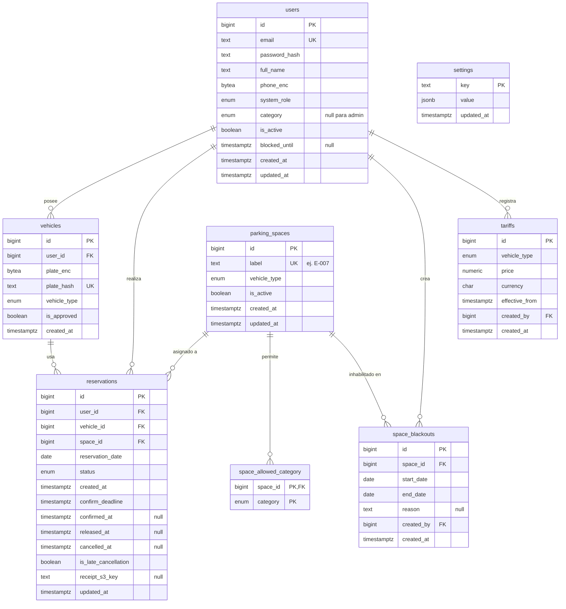

# Modelo de Datos — Sistema de Reserva y Gestión de Parqueos

> Documento de diseño. Define el esquema relacional que respalda los casos de uso P0–P2 sobre
> **PostgreSQL 16 (RDS)**. Todavía **no** es SQL ejecutable; el DDL (`schema.sql`) se redacta una vez
> aprobado este diseño.

---

## 1. Resumen y decisiones de diseño

El sistema permite que los colaboradores de **una empresa** reserven espacios de parqueo por día,
en un esquema de trabajo híbrido donde hay menos espacios que empleados. El modelo prioriza
**eficiencia y simplicidad**, evitando tablas y columnas que no aporten a los casos de uso.

Decisiones tomadas:

| Decisión | Elección | Razón |
|---|---|---|
| **Multi-tenant** | **Single-company** | Un despliegue = una empresa. Sin tabla `companies` ni `company_id`. Menos joins, menos índices. |
| **Alcance v1** | **P0 + P1/P2 ligero** | Núcleo (usuarios, vehículos, espacios, reservas) + tarifas con auditoría. Asistencia y penalizaciones se derivan de `reservations`. |
| **Acceso a espacios** | **M:N categorías permitidas** | UC5 habla de "roles autorizados" (plural): un espacio puede admitir varias categorías. |

Tres principios sostienen todo el modelo:

1. **El estado del espacio se *deriva*, no se almacena.** `Disponible / Reservado / Ocupado` **no** es
   una columna en `parking_spaces`; se calcula por `(espacio, fecha)` a partir de la reserva activa.
   Una sola columna `estado` no puede representar "ocupado hoy, libre mañana" y se desincroniza.
2. **Atomicidad mediante índice único parcial**, no bloqueos de aplicación. Responde directamente a
   la pregunta abierta del documento sobre cómo se garantiza que dos personas no reserven el mismo
   espacio (ver §5).
3. **Dos ejes de "rol" separados**, nunca fusionados en una columna:
   - `system_role` (admin | driver) → autenticación y permisos (UC1, UC4).
   - `category` (ejecutivo | operativo | visitante_frecuente) → qué pool de espacios puede usar (UC5, Fn2).

---

## 2. Diagrama Entidad-Relación



---

## 3. Enums

| Enum | Valores | Uso |
|---|---|---|
| `system_role` | `admin`, `driver` | Permisos de autenticación (UC1, UC4). |
| `collaborator_category` | `ejecutivo`, `operativo`, `visitante_frecuente` | Pool de espacios accesible (UC5, Fn2). |
| `vehicle_type` | `auto`, `moto`, `camioneta` | Tipo de vehículo y de espacio. `auto` ≡ "carro"; valores alineados con los datos de prueba de CU-02. |
| `reservation_status` | `reservada`, `ocupada`, `liberada`, `cancelada`, `expirada` | Ciclo de vida de la reserva (ver §6). |

> Se usan **enums** por ser un conjunto pequeño y estable. Si los tipos de vehículo cambiaran con
> frecuencia, migrar a una tabla de catálogo es trivial.

---

## 4. Especificación tabla por tabla

Todas las PK son `bigint GENERATED ALWAYS AS IDENTITY` (índices pequeños y secuenciales). Todas las
marcas de tiempo son `timestamptz` con `default now()` salvo que se indique.

### `users` — colaboradores y administradores
Una sola tabla, diferenciada por `system_role`.

| Columna | Tipo | Nulo | Notas |
|---|---|---|---|
| `id` | bigint | no | PK |
| `email` | text | no | **UNIQUE**. Login (UC1). |
| `password_hash` | text | no | bcrypt/argon2. No se guarda el password en claro. |
| `full_name` | text | no | |
| `phone_enc` | bytea | sí | Teléfono **cifrado** (dato sensible). |
| `system_role` | `system_role` | no | `admin` o `driver`. |
| `category` | `collaborator_category` | sí | `null` para admins; obligatorio para drivers (Fn2). |
| `is_active` | boolean | no | `default true`. Desactivar **conserva el historial** (UC4). |
| `blocked_until` | timestamptz | sí | Bloqueo temporal por cancelaciones tardías (Fn5). `null` = no bloqueado. |
| `created_at` / `updated_at` | timestamptz | no | |

> Reglas de aplicación (no de esquema): "ningún colaborador puede modificar su propio rol ni el de
> terceros" se aplica en la capa de autorización del API, no con constraints.

### `vehicles` — vehículos del colaborador
Un colaborador puede tener varios; reservar exige uno **aprobado** (Fn1).

| Columna | Tipo | Nulo | Notas |
|---|---|---|---|
| `id` | bigint | no | PK |
| `user_id` | bigint | no | FK → `users(id)` |
| `plate_enc` | bytea | no | Placa **cifrada** (dato sensible). |
| `plate_hash` | text | no | **UNIQUE**. HMAC de la placa: garantiza unicidad y permite búsqueda sin descifrar. |
| `vehicle_type` | `vehicle_type` | no | |
| `is_approved` | boolean | no | `default false`. Debe estar vinculada **y aprobada** para reservar (Fn1). |
| `created_at` | timestamptz | no | |

### `parking_spaces` — inventario de espacios (UC5)

| Columna | Tipo | Nulo | Notas |
|---|---|---|---|
| `id` | bigint | no | PK |
| `label` | text | no | **UNIQUE**. Identificador humano, ej. `E-007`. |
| `vehicle_type` | `vehicle_type` | no | Tipo de vehículo admitido. |
| `is_active` | boolean | no | `default true`. Activación/desactivación permanente (UC4 / CU-02-04). |
| `created_at` / `updated_at` | timestamptz | no | `updated_at` alimenta `ultima_actualizacion`. |

### `space_allowed_category` — M:N categorías ↔ espacio (Fn2)
Qué categorías de colaborador pueden usar cada espacio.

| Columna | Tipo | Nulo | Notas |
|---|---|---|---|
| `space_id` | bigint | no | FK → `parking_spaces(id)` `ON DELETE CASCADE` |
| `category` | `collaborator_category` | no | |
| | | | **PK compuesta** `(space_id, category)` |

### `space_blackouts` — inhabilitación por rango de fechas (UC5)
Un espacio es reservable en la fecha D solo si `is_active` y **ningún** blackout cubre D.

| Columna | Tipo | Nulo | Notas |
|---|---|---|---|
| `id` | bigint | no | PK |
| `space_id` | bigint | no | FK → `parking_spaces(id)` |
| `start_date` | date | no | |
| `end_date` | date | no | `CHECK (end_date >= start_date)` |
| `reason` | text | sí | |
| `created_by` | bigint | no | FK → `users(id)` |
| `created_at` | timestamptz | no | |

### `reservations` — corazón del modelo
Sostiene disponibilidad, atomicidad, liberación automática, liberación anticipada, penalizaciones,
historial de asistencia y el comprobante QR.

| Columna | Tipo | Nulo | Notas |
|---|---|---|---|
| `id` | bigint | no | PK |
| `user_id` | bigint | no | FK → `users(id)` |
| `vehicle_id` | bigint | no | FK → `vehicles(id)`. Valida placa registrada (Fn1). |
| `space_id` | bigint | no | FK → `parking_spaces(id)` |
| `reservation_date` | date | no | Día de la reserva. |
| `status` | `reservation_status` | no | Ver ciclo de vida en §6. |
| `created_at` | timestamptz | no | Momento de creación. |
| `confirm_deadline` | timestamptz | no | `created_at + 20 min`. Lo escanea el worker de liberación (P1). |
| `confirmed_at` | timestamptz | sí | Confirmación de llegada ("Ocupar Parqueo"). Asistencia (Fn3). |
| `released_at` | timestamptz | sí | Salida / liberación anticipada (Fn4). |
| `cancelled_at` | timestamptz | sí | Momento de cancelación. |
| `is_late_cancellation` | boolean | no | `default false`. Cancelación tardía (Fn5). |
| `receipt_s3_key` | text | sí | Clave del PDF/QR en S3 (UC3). |
| `updated_at` | timestamptz | no | Alimenta `ultima_actualizacion` de disponibilidad. |

### `tariffs` — historial de precios (append-only, UC8)
**Nunca se hace UPDATE**: cada cambio es un INSERT con su marca de tiempo (auditoría). El precio
vigente es la fila más reciente por `vehicle_type`.

| Columna | Tipo | Nulo | Notas |
|---|---|---|---|
| `id` | bigint | no | PK |
| `vehicle_type` | `vehicle_type` | no | |
| `price` | numeric(10,2) | no | |
| `currency` | char(3) | no | `default 'GTQ'`. |
| `effective_from` | timestamptz | no | `default now()`. |
| `created_by` | bigint | no | FK → `users(id)` |
| `created_at` | timestamptz | no | |

### `settings` — política configurable por el admin
Alternativa ligera a variables de entorno, porque UC5 indica que la penalización es configurable.

| Columna | Tipo | Nulo | Notas |
|---|---|---|---|
| `key` | text | no | PK. Ej. `cancellation_window_hours`, `max_late_cancellations_month`. |
| `value` | jsonb | no | |
| `updated_at` | timestamptz | no | |

---

## 5. Índices y atomicidad

Índices sobre `reservations`:

| Índice | Definición | Propósito |
|---|---|---|
| **No double-booking** | `UNIQUE (space_id, reservation_date) WHERE status IN ('reservada','ocupada')` | Garantiza una sola reserva activa por espacio/día. |
| **Una reserva activa/día** | `UNIQUE (user_id, reservation_date) WHERE status IN ('reservada','ocupada')` | Fn1: el colaborador solo puede tener una reserva activa por día. |
| Disponibilidad | `(reservation_date, status)` | Consulta `GET /availability`. |
| Worker de liberación | `(status, confirm_deadline)` | Escaneo eficiente de reservas por expirar (P1). |
| Asistencia / penalización | `(user_id, reservation_date)` | Historial (Fn3) y conteo mensual de cancelaciones tardías (Fn5). |

**Mecanismo de atomicidad (responde la pregunta abierta del documento).** Dos peticiones de reserva
simultáneas para el mismo espacio y día ejecutan `INSERT` concurrentes. El **índice único parcial**
permite que solo uno tenga éxito; el otro recibe una violación de unicidad que el API traduce a un
rechazo (HTTP 409). Es **ACID a nivel de base de datos**, sin bloqueo pesimista ni cola de mensajes.

- La **liberación anticipada** (Fn4) y el **timeout de 20 min** (P1) cambian el `status` a
  `liberada`/`expirada`, que salen del conjunto activo del índice → el cupo `(espacio, fecha)` queda
  libre y otro colaborador puede reservarlo el mismo día.
- Cancelar y volver a reservar el mismo día es válido: `cancelada` no está en el conjunto activo.

---

## 6. Ciclo de vida de la reserva

```
                 POST /reservar
                      │
                      ▼
                 ┌──────────┐  confirma llegada ("Ocupar")   ┌─────────┐
                 │ reservada │ ─────────────────────────────► │ ocupada │
                 └──────────┘                                 └─────────┘
                   │      │                                        │
   timeout 20 min  │      │ cancela usuario                        │ salida / liberación anticipada
   (worker P1)     │      ▼                                        ▼
                   │  ┌───────────┐                          ┌──────────┐
                   ▼  │ cancelada │                          │ liberada │
              ┌─────────┐ └───────────┘                      └──────────┘
              │ expirada │   (is_late_cancellation si aplica Fn5)
              └─────────┘
```

Mapeo a los estados visibles de disponibilidad (CU-02): `ocupada → Ocupado`,
`reservada → Reservado`, cualquier otro o sin reserva → `Disponible`.

---

## 7. Consulta de disponibilidad (CU-02) — derivada y sensible al rol

El estado se calcula al consultar; no hay columna almacenada. Patrón de la vista/consulta para una
fecha dada:

```sql
-- Disponibilidad para CURRENT_DATE; el filtro por categoría y tipo se aplica por petición.
SELECT s.id            AS id_espacio,
       s.label,
       s.vehicle_type  AS tipo_vehiculo,
       CASE
         WHEN r.status = 'ocupada'  THEN 'Ocupado'
         WHEN r.status = 'reservada' THEN 'Reservado'
         ELSE 'Disponible'
       END             AS estado,
       COALESCE(r.updated_at, s.updated_at) AS ultima_actualizacion
FROM parking_spaces s
LEFT JOIN reservations r
       ON r.space_id = s.id
      AND r.reservation_date = CURRENT_DATE
      AND r.status IN ('reservada', 'ocupada')
WHERE s.is_active = true
  AND NOT EXISTS (                                  -- excluye espacios en blackout
        SELECT 1 FROM space_blackouts b
        WHERE b.space_id = s.id
          AND CURRENT_DATE BETWEEN b.start_date AND b.end_date)
  -- Filtros por petición:
  -- AND s.vehicle_type = :tipo_vehiculo            -- CU-02-03
  -- AND EXISTS (SELECT 1 FROM space_allowed_category a   -- restricción de rol (Fn2)
  --             WHERE a.space_id = s.id AND a.category = :categoria_del_conductor)
;
```

Esto cubre CU-02: devuelve `id_espacio, tipo_vehiculo, estado, ultima_actualizacion` (ES-CU02-01),
refleja cambios vía `updated_at` (ES-CU02-02), filtra por `tipo_vehiculo` (ES-CU02-03) y excluye
espacios inactivos (ES-CU02-04). La autenticación 401 (ES-CU02-05) es responsabilidad del API.

El precio vigente (UC8) se expone con una vista equivalente:

```sql
CREATE VIEW current_tariffs AS
SELECT DISTINCT ON (vehicle_type) vehicle_type, price, currency, effective_from
FROM tariffs
ORDER BY vehicle_type, effective_from DESC;
```

---

## 8. Cifrado de datos sensibles

- **En reposo:** RDS ya cifra todo el almacenamiento (`storage_encrypted = true` en el módulo
  `infra/modules/database`).
- **A nivel de columna** para `phone_enc` y `plate_enc`: se recomienda **cifrado en la aplicación
  (AES-GCM)** con la llave en **AWS Secrets Manager** — mejor gestión de llaves que guardarlas en la
  base. Para la placa se almacena además `plate_hash` (HMAC) que permite unicidad y búsqueda sin
  descifrar. `pgcrypto` (`pgp_sym_encrypt`) queda como alternativa documentada.

---

## 9. Fuera de alcance / diferido (anti-overengineering)

- **Sin tabla de sesiones/tokens** — el JWT es stateless (UC1).
- **Sin columna `estado` en `parking_spaces`** ni tabla de estado por día — se deriva.
- **Sin tablas de asistencia ni de cancelaciones** — son consultas sobre `reservations`
  (asistencia = filtrar por `user_id` con `confirmed_at`/`released_at`; cancelaciones tardías =
  `COUNT(*) WHERE is_late_cancellation AND reservation_date` en el mes).
- **Sin pagos/transacciones** — fuera de alcance según el documento.
- **Sin log de notificaciones** en v1 — se puede añadir si se requiere auditar entregas de correo.

---

## 10. Trazabilidad: caso de uso → esquema

| Caso de uso / funcionalidad | Cubierto por |
|---|---|
| UC1 Inicio de sesión | `users.email`, `users.password_hash`, `users.system_role` |
| UC2 Disponibilidad en tiempo real | Consulta §7 sobre `parking_spaces` + `reservations` + `space_blackouts` |
| UC3 Reserva + comprobante | `reservations` (índice único §5) + `reservations.receipt_s3_key` (S3) |
| UC4 Gestor de usuarios | `users` (`system_role`, `category`, `is_active`) |
| UC5 Gestor de parqueos | `parking_spaces`, `space_allowed_category`, `space_blackouts` |
| UC6 Liberación automática (P1) | `reservations.confirm_deadline` + `status` (worker) |
| UC7 Dashboard de ocupación (P2) | Agregación sobre la consulta §7 |
| UC8 Gestión de tarifas (P2) | `tariffs` (append-only) + vista `current_tariffs` |
| Fn1 Reserva con placa registrada / 1 activa por día | `vehicles.is_approved` + índice único `(user_id, reservation_date)` |
| Fn2 Espacios por perfil | `space_allowed_category` ↔ `users.category` |
| Fn3 Historial de asistencia | Consulta sobre `reservations` (`confirmed_at`, `released_at`) |
| Fn4 Liberación anticipada | `reservations.status = liberada` + `released_at` |
| Fn5 Penalización por cancelación | `reservations.is_late_cancellation`, `users.blocked_until`, `settings` |
